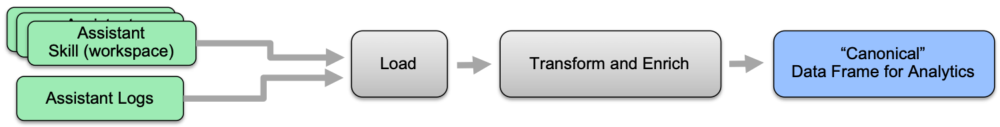
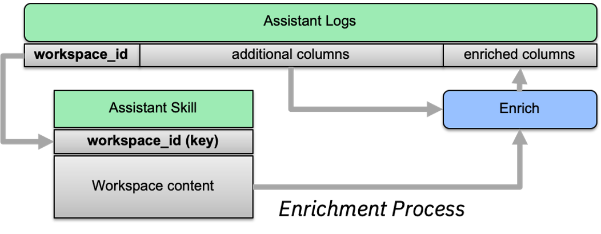

# Frequently Asked Questions

- **Usage**
  - [KeyError during to_canonical_WA_v2](#key-error-to-canonical)
  - [How can I enable interactive ipywidgets](#enable-ipywidgets)

- **Data Integration**
  - [What is the format of the canonical data model](#canonical-data-model)
  - [How is information from the logs and skills combined](#logs-skill-enrichment)
 
 
## Usage

### KeyError during to_canonical_WA_v2

The enrichment step failed becuase the data contains a reference to a `workspace_id` which is not defined in `WA_Assistant_Skills` object.   This can happen if you don't have the correct skill definition, or it is defined using another workspace_id.  You can add another skill/version to your WA_Assistant_Skills object to match the missing value.

### How can I enable interactive ipywidgets

Some visual components provide an optional user interface to modify the configuration of the component.   You can call `conversation_analytics_toolkit.enable_widgets()` to enable the use of ipywidgets.  **Note**: ipywidgets require an additional installation step in your Jupyter environment.  For more detail refer to [ipywidgets installation guide](https://ipywidgets.readthedocs.io/en/latest/user_install.html)

## Data Integration

### What is the format of the canonical data model

During the load-extract-transform step, relevant fields are extracted and transformed from the logs, and additional fields are combined and enriched from the workspace files to faciliate exploration, analysis and visualization.  The canonical data model for analytics is a data interface for the features demonstrated in this notebook. It includes the following columns: 

**Extracted columns from the log artifact**:
* **log_id** - unique identifier of the turn
* **response_timestamp**
* **conversation_id** - unique identifier of the conversation
* **nodes_visited** - a list of dialog nodes visited in the turn
* **branch_exited** - indicator whether the WA dialog branch was exited during the turn
* **branch_exited_reason** - either completed or fallback
* **intent_1** - name of highest confidence intent detected by WA
* **intent_1_confidence**
* **response_type**
* **request_text**
* **response_text**
* **skill_id** - same as workspace_id
* **event_type** - REQUEST_RESPONSE corresponding to the /message API.  Additional assistant-level event types, e.g. feedback, can be brough from external sources.  

**Enriched columnns, based on skills artifact**:
* **skill_name** - the name of the skill
* **intent_1_dialog_triggered** - name of highest confidence intent that triggered a condition in the dialog
* **node_visited_str** - a list of human_readable string represention of the nodes_visited list.  Includes a summary representation of the node type, title, and conditions where applicable.
* **turn_label** - a single human readable string value that represents the turn.  Heuristics based on the values in nodes_visited is applied.

### How is information from the logs and skills combined

The `workspace_id` field in the logs is used to match data in the logs, with data of the corresponding skill.  In case your logs contain a different field to match than the workspace_id (e.g. `skill name`), you can configure the extract-transform phase to use that column by setting the `skill_id_field` parameter of `to_canonical_WA_v2`

