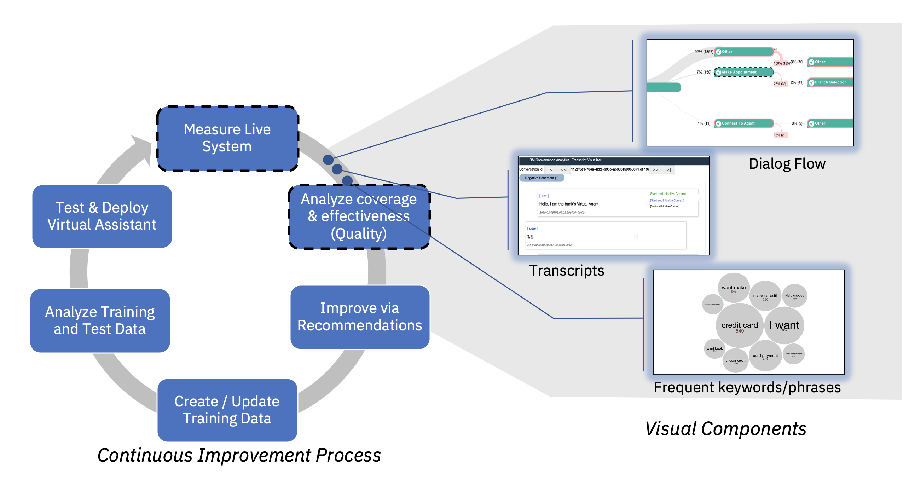

# Watson Assistant Dialog Flow Analysis

> Note: help us stay in touch and improve this notebook by clicking on the :star: star icon (top right).

This repository hosts the the Watson Assistant Dialog Flow Analysis Notebook and the underlying conversation analytics toolkit library.

 
Table of Contents

 
 [Introduction](#introduction) 
 [Getting Started](#getting-started) 
 [Guides](#guides) 
 [Frequently Asked Questions](#frequently-asked-questions) 
 [License](#license) 
 [Contributing](#contributing) 

## Introduction

The Watson Assistant Dialog Flow Analysis Notebook can help you assess and analyze user journeys and issues related to the dialog flow of ineffective (low quality) conversations based on production logs.  The notebook can help you with questions such as:
- What are the common conversation steps and flows within the assistant 
- Which flows have low task completion rates and high abandonment (ineffective conversations)
- Where along the dialog steps users lose engagement with your assistant
- What are common terms and steps that may lead to abandonment

This notebook extends the [Measure and Analyze notebooks](https://github.com/watson-developer-cloud/assistant-improve-recommendations-notebook) by providing additional capabilities to assess and analyze effectiveness - focused more on issues related to the dialog flow.  For more details, check out [IBM Watson Assistant Continuous Improvement Best Practices](https://github.com/watson-developer-cloud/assistant-improve-recommendations-notebook/raw/master/notebook/IBM%20Watson%20Assistant%20Continuous%20Improvement%20Best%20Practices.pdf).

## Getting Started

The notebook requires a Jupyter Notebook environment and Python 3.6+.   You can either install Jupyter Notebook to run locally or you can use Watson Studio on the cloud.

### Using Jupyter Notebook
1. Install Python 3.6+
2. Install Jupyter notebook. Checkout the [Jupyter/IPython Notebook Quick Start Guide](https://jupyter-notebook-beginner-guide.readthedocs.io/en/latest/install.html) for more details
3. Download the [notebooks/Dialog Flow Analysis Notebook.ipynb](https://github.com/watson-developer-cloud/assistant-dialog-flow-analysis/blob/master/notebooks/Dialog%20Flow%20Analysis%20Notebook.ipynb) file.   
4. Start jupyter server `jupyter notebook`
5. Run the `Dialog Flow Analysis Notebook.ipynb`

### Using Watson Studio
1. In Watson Studio, select `Add to Project`-->`Notebook`.  Choose `From URL` and paste this [url](https://raw.githubusercontent.com/watson-developer-cloud/assistant-dialog-flow-analysis/master/notebooks/Dialog%20Flow%20Analysis%20Notebook.ipynb).  Alternately you can select `From file` and upload the `notebooks/Dialog Flow Analysis Notebook.ipynb` file.

Alternately, you can import and modify the [sample notebook on Watson Studio Gallery](https://dataplatform.cloud.ibm.com/exchange/public/entry/view/013c690997e27f3a8d9133265327a9e5?context=wdp).

## Guides
* Learn more about the Dialog Flow Analysis in this [blog](https://medium.com/ibm-watson/do-you-know-where-and-why-users-drop-off-the-conversation-6246e99baddc)
* See a live example output of the notebook on [Watson Studio Gallery](https://dataplatform.cloud.ibm.com/exchange/public/entry/view/013c690997e27f3a8d9133265327a9e5?context=wdp)

## Frequently Asked Questions
See [FAQ.md](FAQ.md) for frequently asked questions 

## License
This library is licensed under the [Apache 2.0 license](http://www.apache.org/licenses/LICENSE-2.0).

## Contributing 
See [CONTRIBUTING.md](CONTRIBUTING.md) and [DEVELOPER.MD](DEVELOPER.MD) for more details on how to contribute

## Contributor List

| | | | | |
:-------------------------:|:-------------------------:|:-------------------------:|:-------------------------:|:-------------------------:|
   <b>[Avi Yaeli](https://github.com/ayaeli)<b> |    <b>[Sergey Zeltyn](https://github.com/Sergey-Zeltyn)<b> |    <b>[Zhe Zhang](https://github.com/zzhang13)<b> |    <b>[Eric Wayne](https://github.com/eric-wayne)<b> |    <b>[David Boaz](https://github.com/boazdavid)<b> |

